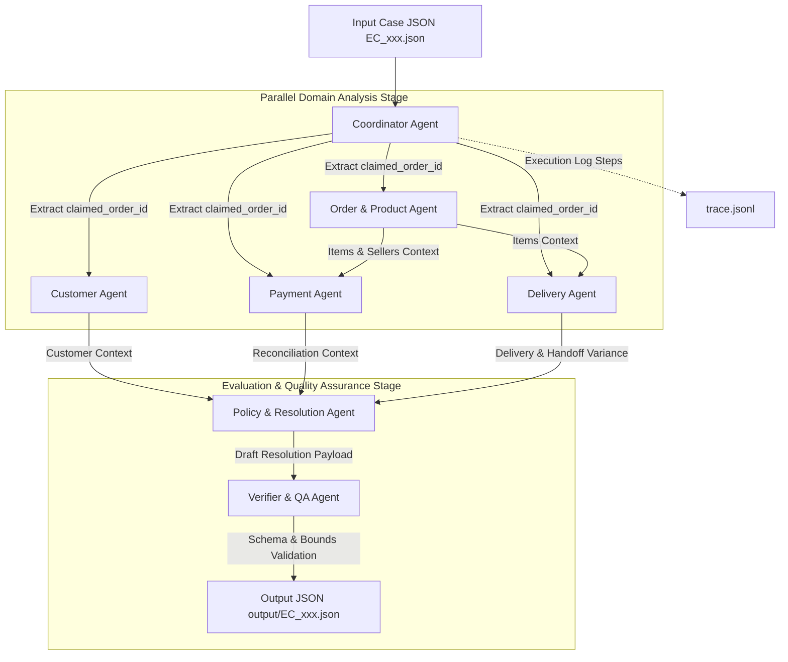

# System Architecture — Multi-Agent E-commerce Dispute Resolution

## 1. Overview
Hệ thống Multi-Agent A2A được thiết kế để tự động hóa quy trình điều tra 50 khiếu nại thương mại điện tử từ dữ liệu Olist. Hệ thống gồm 7 Agent chuyên môn hóa, hoạt động độc lập trên từng domain dữ liệu và trao đổi thông tin qua quy trình handoff đa bước trước khi ra quyết định cuối cùng.

---

## 2. Agent Workflow Diagram (Agent-to-Agent Handoff)

---

## 3. Agent Roles & Data Permissions

| Agent Name | Role & Responsibility | Read Access Scope | Handoff Artifact Output |
| :--- | :--- | :--- | :--- |
| **Coordinator Agent** | Orchestrator nhận case, điều phối công việc và ghi vết trace log. | `input/EC_xxx.json` | Case ID & Claimed Order ID |
| **Customer Agent** | Truy xuất danh tính khách hàng & lịch sử giao dịch trước đây. | `orders.csv`, `customers.csv` | `customer_context` (`customer_unique_id`, `related_order_ids`) |
| **Order & Product Agent** | Phân tích items, sản phẩm, seller và dịch tên category. | `order_items.csv`, `products.csv`, `sellers.csv`, `category_translation.csv` | `product_context`, Item totals, Freight totals, Seller lists |
| **Payment Agent** | Tính tổng thanh toán, đối soát với giá trị đơn hàng ($item + freight$). | `order_payments.csv` | `payment_reconciliation` (`expected_total`, `difference`, `reconciled`) |
| **Delivery Agent** | Phân tích mốc thời gian giao hàng & kiểm tra seller bàn giao trễ. | `orders.csv`, `order_items.csv` | `delivery_analysis` (`delivery_variance_hours`, `late_handoff_seller_ids`) |
| **Policy Agent** | Đánh giá quy tắc `EC_POLICY_V2`, xác định Primary/Secondary issues, refund, evidence IDs. | Aggregated Agent Outputs | Draft Resolution Payload |
| **Verifier Agent** | Kiểm tra giới hạn mảng, làm tròn 2 chữ số thập phân, validate JSON schema. | Draft Resolution Payload | Output File `output/EC_xxx.json` |

---

## 4. Business Rules Evaluation (`EC_POLICY_V2`)

1. **Primary Issues Priority**:
   - `canceled_order_paid`: `order_status = canceled` và `payment > 0` $\rightarrow$ Hoàn full tiền mặt.
   - `unavailable_order_paid`: `order_status = unavailable` và `payment > 0` $\rightarrow$ Hoàn full tiền mặt.
   - `late_delivery_seller`: Giao sau estimated date và carrier nhận hàng sau `shipping_limit_date` của ít nhất 1 seller $\rightarrow$ Hoàn cước vận chuyển (`freight_total_brl`).
   - `late_delivery_logistics`: Giao sau estimated date và không seller nào bàn giao trễ $\rightarrow$ Hoàn cước vận chuyển (`freight_total_brl`).
   - `valid_split_payment`: Thanh toán từ 2 row trở lên, $|difference| \le 0.10$ BRL $\rightarrow$ Giải thích split payment, không hoàn tiền.
   - `unsupported_late_claim`: Đơn giao đúng hạn và thanh toán khớp $\rightarrow$ Từ chối khiếu nại.

2. **Secondary Issues Order**:
   - `multi_item_order` $\rightarrow$ `multi_seller_order` $\rightarrow$ `split_payment` $\rightarrow$ `repeat_customer` $\rightarrow$ `multiple_categories`.
